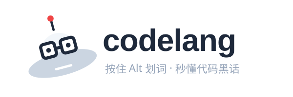

<p align="center">
  
</p>

<h1 align="center">codelang · 看不懂代码和黑话？按住 Alt 划一下，立刻解释</h1>

<p align="center">
  <b>一个用大白话和小故事，给你解释代码英文、互联网黑话、AI 术语的桌面小工具。</b><br>
  <i>Windows 上按住 Alt + 鼠标划词，鼠标旁立刻弹出解释卡片。</i>
</p>

<p align="center">
  
  
  
  
</p>

---

## 这玩意儿是干嘛的？

你有没有过这种时刻：

- 看公众号文章看到「**这个大模型用了 Transformer 架构**」——啥是 Transformer？
- 同事开会说「**先对齐一下颗粒度**」——对啥齐？颗粒度是颗粒还是度？
- HR 通知你「**这次裁员按 N+1 赔偿**」——N 是几？为啥还要加 1？
- 男朋友兴奋地讲「**今天用 Cursor 写了个 ReAct agent，把 RAG 接通了**」——你能听懂哪个字？

打开有道翻译查 "Transformer"，给你的解释是「变压器」。查「对齐」给你的是 "align"。**没卵用**。

codelang 就是为解决这事造的。它的解释是这样的：

> **Transformer**：2017 年 Google 一篇论文（Attention Is All You Need）提出的神经网络架构——从此改变了 AI 圈。当代所有大模型（GPT/Claude/Gemini/Llama）底层都是 Transformer。它的核心创新：用 attention 机制代替之前的循环结构，又快又能学远距离关系。

> **对齐**：想象军训时教官喊"向左看齐"——大家原本朝不同方向，立刻调成一条线。大厂里"对齐一下"就是这种「找几个人开短会同步信息、确认大家理解一致」。常发生在做事前先开半小时碰需求/方向。

> **N+1**：裁员标准补偿——每工作一年补一个月工资，多 1 个月代通知金。N=工作年数。如果直接走还有 2N。

每一条都是讲故事 + 举例子，不懂代码也能秒懂。

---

## 适合谁

- ✅ **互联网公司新人**——上一秒"颗粒度"下一秒"赋能"，听懂同事一半就够你忙
- ✅ **准备面试的同学**——八股文里 "幂等 / 熔断 / 降级 / CAS / 缓存击穿" 一个个查清楚
- ✅ **转行做产品/运营/设计**——需要听懂研发但不想学编程
- ✅ **看技术博客/AI 资讯**——掘金、CSDN、知乎里那些英文术语再也不烦人
- ✅ **想看懂男朋友/女朋友每天在干嘛**的非程序员家属
- ✅ **打算转行 AI 行业**——LangChain / RAG / Transformer / RLHF / LoRA 全部看得懂

---

## 它和有道翻译/Google 翻译有什么区别？

| 你选中的词 | 有道翻译给的 | codelang 给的 |
|---|---|---|
| 幂等 | idempotent（看不懂）| 想象电梯按钮——按一下还是按八下都只来一次。同一个动作做几次结果一样。互联网做支付接口必须做幂等，不然你重复点就被重复扣款。|
| 对齐 | align（意思全错）| 想象军训教官喊"向左看齐"——大家原本朝不同方向立刻调成一条线。大厂里就是开个短会同步信息。|
| 死锁 | deadlock（看不懂）| 想象两个人面对面卡在窄门里，A 让 B 先过、B 让 A 先过，俩人都不动也都不让，于是僵在门口谁也过不去。|
| 闭环 | closed loop（什么是闭环？）| 想象洒水后水流回水库再循环——头尾相接持续运转。互联网里就是流程从头跑到尾且结果回流到起点形成反馈。|
| Transformer | 变压器（哈哈）| 2017 年 Google 一篇论文提出的神经网络架构，当代所有大模型（GPT/Claude）底层都是 Transformer。|

**翻译工具只翻字面，codelang 给你讲清这个词在中国互联网/技术语境里到底是个什么意思。**

---

## 词库覆盖了啥（数字看）

| 类型 | 数量 | 例子 |
|---|---|---|
| **AI / 大模型术语** | ~90 条 | Transformer / RLHF / LoRA / RAG / LangChain / ReAct / MCP / 幻觉 / 提示工程 |
| **开发技术词** | ~330 条 | 幂等 / CAS / 熔断 / 缓存击穿 / 死锁 / 微服务 / Docker / React Hook / closure |
| **互联网黑话** | ~150 条 | 对齐 / 颗粒度 / 抓手 / 赋能 / 闭环 / 中台 / 复盘 / 拉通 / 卷王 / 躺平 |
| **缩写术语** | ~95 条 | OKR / KPI / GMV / DAU / QPS / SSR / RAG / LGTM / FYI / TODO |
| **职场俚语** | ~45 条 | 996 / 被优化 / N+1 / 福报 / P 几 / T 几 / HC / 内推 / 35 岁危机 |
| **额外兜底翻译** | ~210 条 | 常见英文编程词（namespace / wrapper / adapter / singleton ...）|
| **合计** | **~890 条** | 覆盖你日常 99% 的疑惑 |

每一条都是「比喻 + 真实场景 + 具体例句」三段式，对完全不懂代码的人也能秒懂。

---

## 怎么用（3 分钟跑起来）

### 0. 最懒办法：让 AI 帮你装（推荐零基础用户）

如果你电脑上有任何 **agentic AI**——Claude Code、Cursor、Windsurf、OpenCode、通义灵码、Codex CLI 之类——直接复制这一段给它：

> 请帮我装这个工具：https://github.com/XiaoChu-1208/codelang
> 装完直接帮我跑起来。

AI 会自己 clone 仓库、装 Python 依赖、启动应用。你只需要看着托盘出现蓝色 codelang 图标就行。

为啥这么省事？这种 AI 助手能直接读你电脑、跑命令、装东西——本质就是把"我替你跑这些命令"自动化了。整个安装过程它替你处理，你不用碰一行命令。

> 💡 没有 Claude Code？可以装 [Claude Code 官网](https://claude.ai/code) 或 [Cursor](https://cursor.com)，国产可以用通义灵码、CodeBuddy 等。任何一个能跑命令的 AI 都行。

### 1. 手动装（如果你懒得搞 AI 助手）

需要你电脑上有 **Python 3.10 或以上**。没有的话：

- Windows 在 [python.org 官网](https://www.python.org/downloads/) 下载安装，安装时记得勾选「Add to PATH」
- 装好后命令行敲 `py --version` 能看到版本号就行

然后下载本项目：

```powershell
git clone https://github.com/XiaoChu-1208/codelang.git
cd codelang
py -m pip install -r requirements.txt
```

如果你完全不懂 git，也可以点本仓库右上角「Code → Download ZIP」，解压到任意目录。

### 2. 启动

**最简单**：双击 `desktop\run.bat` —— 后台静默启动，**不会有任何黑窗口**。启动成功你会在屏幕右下角系统托盘看到一个 codelang 蓝色小图标。

排查问题想看实时日志？两种办法：
- **托盘菜单点「查看日志」**：自动用记事本打开 `~/.codelang/codelang.log`
- 或双击 `desktop\run_console.bat`：保留 cmd 黑窗显示实时输出（仅调试时用）

想开机自启？把 `run.bat` 的快捷方式拖进 Windows 启动文件夹（`Win+R` → `shell:startup`）即可。

### 3. 用

**在任何窗口里**——浏览器、微信、Word、PDF、Cursor、Claude 桌面端——按住 **Alt 键**，鼠标划选一个不懂的词，松开鼠标的瞬间词的解释立刻弹在鼠标旁边。

#### 两种触发姿势

| 姿势 | 适合场景 | 操作 |
|---|---|---|
| **Alt + 双击词** | 单个单词最快 | 按住 Alt 不放，鼠标在那个词上双击两下 |
| **Alt + 划词** | 短语 / 多词 / 部分截取 | 按住 Alt 不放，鼠标按下拖到词尾松开 |

为啥双击就行？所有现代浏览器/编辑器/Office/PDF 阅读器都有"双击一个单词自动选中整词"的默认行为。codelang 利用这个特性，**按住 Alt 直接在词上双击**就触发，比划词更快。

**具体例子**：
- 看博客读到「这个 `Transformer` 架构」——按住 Alt 在 Transformer 上双击 → 立刻看到解释
- 微信里同事甩来「先 `对齐` 一下」——按住 Alt 在"对齐"上双击 → 立刻看到解释
- 文档里 `LangChain` 不懂——按住 Alt 双击 → 解释弹出
- 选短语用划词：「按住 Alt，鼠标从 R 拖到 G」选中 `RAG` 旁边的完整短语 `Retrieval-Augmented Generation`

#### 边界处理也很贴心

- 同时选两个词（比如 `Promise async`）：两个解释**堆叠展示**
- 选了一个词夹在标点里（比如 `es,YAML`）：**自动识别**出 YAML
- 选了中文里嵌入的英文（比如 `用 React 写代码`）：**自动提取** React
- 选了一句话：智能切分多个候选词，逐个展示

按 **Esc** 或 **点窗外**关闭卡片。

### 4. 词库不够用？

**自己加词** —— 卡片弹出"未收录"时点「我录入这个词」按钮，输入含义保存，下次同样的词直接命中。不用懂代码、不用碰文件。

**改现有的** —— 觉得某条解释不够生动？打开 `dict/*.yaml` 任何一个文件改这条 meaning 字段，存盘后托盘菜单点「重新加载词典」立即生效。

---

## 截图

> 卡片样式：浅色 Windows tooltip 风格，1px 边框，跟随鼠标位置，多显示器/高 DPI 自动适配。

（这里放截图）

---

## 常见问题

**Q：会不会有隐私问题？我看的内容会传到哪里？**  
A：**完全本地**。词库是离线 JSON 文件，查询全在你电脑内存里完成，零网络请求。除非你主动开启「AI 兜底」（默认关），才会把没收录的词单独发给 AI 解释——这个功能 100% 可选。

**Q：要联网才能用吗？**  
A：不要。断网状态下完全可以用，词库都在本地。

**Q：响应有多快？**  
A：本地命中 ~80 毫秒（含按 Alt → 取词 → 弹卡片 → 显示），体感是"瞬间"。

**Q：支持 Mac / Linux 吗？**  
A：目前只有 Windows 版（依赖 Win32 API 取剪贴板和监听全局热键）。Mac/Linux 版在规划中，欢迎贡献。

**Q：和浏览器划词翻译比有什么优势？**  
A：浏览器划词翻译只在浏览器里有效，codelang 在**任何窗口**都能用（Cursor、Claude 桌面端、PDF 阅读器、微信、Office 全覆盖）。而且我们不是翻译，是用比喻和场景化语言解释。

**Q：词条解释是 AI 写的吗？**  
A：所有词条都是人工撰写的大白话风格，不是 AI 直接生成的产物（虽然 Claude 帮忙起草，但每条都过了人工调校确保通俗易懂）。

**Q：能贡献新词吗？**  
A：欢迎！直接提 Pull Request 修改 `dict/*.yaml` 文件即可，格式参考已有词条。也可以提 Issue 说"我希望加 XXX 词"。

**Q：付费吗？**  
A：**100% 免费、开源、MIT 协议**。可商用、可改、可分发。

---

## 触发机制原理（给好奇的人）

Windows 上想要"在任何应用里取选中文本"没有公开 API。codelang 的方案：

1. 全局监听鼠标和键盘事件
2. 检测到「鼠标左键 down + Alt 按下」时记录状态
3. 检测到「鼠标左键 up + Alt 仍按住」时认为是有效触发
4. 偷偷向系统发送 Ctrl+C（模拟键盘），让系统把选中内容复制到剪贴板
5. 读剪贴板内容（同时备份原剪贴板内容用完还原）
6. 在内存词库里 O(1) 查询，找到就弹卡片

这是业界主流方案（OpenAI Translator、Bob、Pot 等划词翻译工具都是这套），不存在更优雅的 Windows 取词方法。

---

## 项目结构

```
codelang/
├── dict/                  词库源文件（YAML 格式）
│   ├── devterm.yaml       开发术语 ~330 条
│   ├── ai.yaml            AI/LLM 术语 ~90 条
│   ├── jargon.yaml        互联网黑话 ~150 条
│   ├── abbr.yaml          缩写 ~95 条
│   ├── slang.yaml         职场俚语 ~45 条
│   └── user.yaml          你录入的词（运行时自动追加）
├── desktop/               桌面应用（Alt+划词触发）
│   ├── app.py             主入口
│   ├── ui.py              tooltip 卡片
│   ├── lookup.py          智能查询 + 翻译兜底
│   ├── win.py             Win32 API 封装
│   ├── config.py          配置 + 缓存
│   ├── run.bat            双击启动（带控制台）
│   └── run_silent.vbs     后台静默启动
├── extension-browser/     浏览器扩展（备用方案）
│   ├── dict.json          构建好的词典
│   └── ecdict.json        通用翻译兜底（207 条）
└── tools/
    ├── build_dict.py      YAML → dict.json 构建脚本
    └── setup_translator.py ECDICT 词典扩展工具
```

---

## 词条样例（让你看看风格）

<details>
<summary>开发术语样例</summary>

**幂等**：想象电梯按钮——你按一下电梯开始上来，你心急又连按八下，电梯还是只来一次。"幂等"就是这种性质：同一个动作做一次和做八次，结果完全一样。互联网公司做支付/下单接口必须设计成幂等的。

**缓存击穿**：想象一家网红奶茶店门口贴着"今日特供：明星款"。十分钟后特供卖完撤了告示，那一秒所有想买的人全涌进店里问店员"还有吗还有吗"，店员瞬间被围爆。代码里热门 key 突然过期，缓存查不到，瞬间所有请求挤爆数据库。

**死锁**：想象两个人面对面卡在窄门里，A 让 B 先过、B 让 A 先过，俩人都不动也都不让，于是僵在门口谁也过不去。代码里两个进程互相握着对方需要的钥匙，又互不松手。
</details>

<details>
<summary>AI/LLM 术语样例</summary>

**RLHF**：想象训狗——你给它两个答案 A 和 B，告诉它"A 比 B 好"，狗逐渐学会偏好 A 这一类。RLHF 就是让人类标注员对 LLM 输出打"A 比 B 好"的偏好，再用强化学习把这种偏好教给模型。ChatGPT 出圈的关键技术。

**LoRA**：想象给大型机器人加个小耳机让它学新方言——机器本身没动，外挂一个小模块就改性格。LoRA 就这思路：冻结原模型不动，只在旁边训一个很小的"低秩适配器"模块，训练成本是全参微调的 1%，效果接近。开启个人微调时代。

**幻觉**：想象班里那个最会吹牛的学生——老师叫起来回答，明明不知道却一脸严肃地编一个看似合理的答案。LLM 一本正经地编造事实就是这种"幻觉"：日期、人名、引用全是瞎说但看起来真。
</details>

<details>
<summary>互联网黑话样例</summary>

**抓手**：想象搬一个奇形怪状的箱子——你得先找到能抓住的把手才搬得动。"抓手"就是推动一件大事的具体切入点。"找抓手"=找一个能下手干活的点。

**赋能**：想象工厂供电——总电厂不直接做产品，只把电送给各车间让他们造东西。"赋能"就是"提供工具/数据/方法让别人能把事干成"。基础平台部门最爱说。

**心智**：想象提"高端白酒"你脑子立刻跳出茅台——这种"听到 X 立刻想到 Y"就是心智。营销圈说"占领用户心智"=让你一想到某场景就先想到我家牌子。
</details>

<details>
<summary>缩写样例</summary>

**OKR**：想象老板新年规划"今年公司要成北方第一咖啡品牌"——这是 O（目标）。再细化"新开 100 家店、月销破亿、品牌指数进前五"——这是 KR（关键结果）。

**N+1**：裁员标准补偿——每工作一年补一个月工资，多 1 个月代通知金。N=工作年数。如果直接走还有 2N。

**LGTM**：code review 时的"我看过了没问题"——直白短小，表示同意合代码。
</details>

---

## 进阶：开 AI 兜底（可选，默认关）

如果本地 679 词都没收录到的词，默认显示"未收录"+ 录入按钮让你手动补。如果懒得每次手动，可以让 AI 自动解释：

编辑 `~/.codelang/config.json`：
```json
{
  "provider": "anthropic",
  "api_key": "你的_Anthropic_API_key",
  "model": "claude-haiku-4-5-20251001",
  "llm_fallback_enabled": true
}
```

或换 OpenAI：
```json
{
  "provider": "openai",
  "api_key": "你的_OpenAI_API_key",
  "model": "gpt-4o-mini",
  "llm_fallback_enabled": true
}
```

AI 返回的结果会缓存在 `~/.codelang/llm_cache.json`，同一个词不会重复花钱。

---

## 已实现的边界处理

| 场景 | 行为 |
|---|---|
| 选区只有空白 / 含换行 / 超 32 字 | 静默丢弃，不弹卡片（你不是在查词）|
| 选区带尾标点 `(YAML)` `YAML:` | 自动剥离再查 |
| 选区是「es,YAML」这种多词带分隔 | 切分识别多个词，全部展示 |
| 选区是「和 LangChain 这种」中文夹英文 | 自动提取 LangChain |
| Alt+Tab 后误触 | 双重检查（mouse-down 和 up 都查 Alt）规避 |
| Alt 按住时偷 Ctrl+C 可能产生幻影 Alt 状态 | 已修复，不再合成 Alt UP/DOWN |
| 万一 Alt 真卡住 | 托盘菜单「释放卡住的 Alt」一键清 |
| 用户原剪贴板内容 | 备份+还原，文字不丢；图片那类不还原 |
| 多显示器 / 高 DPI | 自动按光标所在显示器定位卡片 |
| 卡片位置溢出屏幕 | 自动 clamp 到屏幕内 |

---

## 贡献新词 / 改进解释

欢迎 PR！

1. Fork 本仓库
2. 打开 `dict/` 下对应类别的 yaml 文件
3. 按已有格式加一条：

```yaml
- term: 你的词
  aliases: [别名 1, 别名 2]    # 可选
  category: jargon            # devterm/jargon/abbr/slang/devterm 任选
  literal: 字面意思（如有）       # 可选
  meaning: 想象 XXXX —— 这就是 YYYY ……（用比喻 + 场景化语言）
  example: 真实场景例句。
```

4. 跑一下 `py tools/build_dict.py` 确认能编过
5. 提 PR

风格要求：
- 开头用一个生活化比喻或具体场景
- 把比喻映射回这个词的实际含义
- 给一个真实可见的使用场景例句
- **禁用**「在某种意义上」「可以理解为」这种端着的废话

---

## 致谢

- 词条参考但未直接复制了 [mcsrainbow/chinese-internet-jargon](https://github.com/mcsrainbow/chinese-internet-jargon) 和 [EarsEyesMouth/computerese-cross-references](https://github.com/EarsEyesMouth/computerese-cross-references) 的词目，解释文本全部本项目原创
- 通用翻译兜底参考 [skywind3000/ECDICT](https://github.com/skywind3000/ECDICT) 设计
- 触发机制参考 [OpenAI Translator](https://github.com/openai-translator/openai-translator)、Bob 等划词翻译工具

---

## License

MIT —— 自由使用、修改、分发，可商用。

---

## 关键词 / Keywords

划词翻译 · 鼠标悬停翻译 · 代码英文解释 · 互联网黑话词典 · 大厂术语 · 程序员英语 · 编程术语词典 · AI 术语解释 · LLM 术语 · 大模型术语 · 八股文 · 面试术语 · 中文 IT 词典 · 大白话编程 · 桌面划词工具 · Windows 划词工具 · 通用翻译 · Alt 划词 · code dictionary · jargon translator · Chinese tech glossary

</content>
