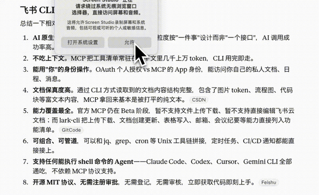
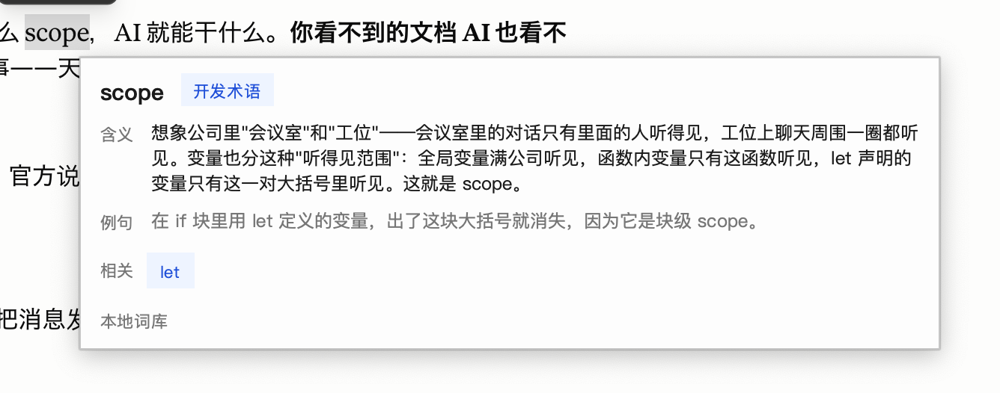
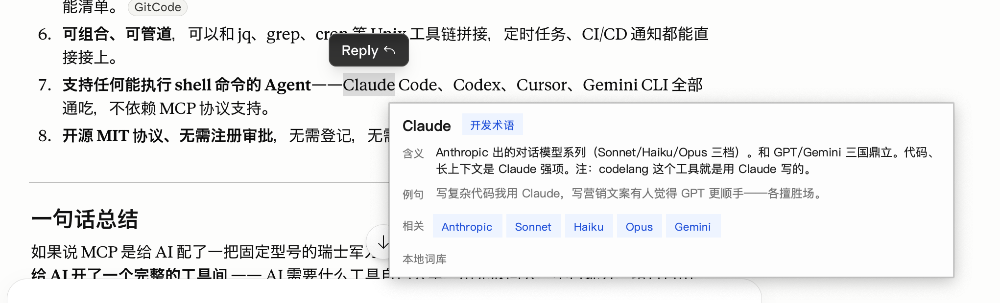
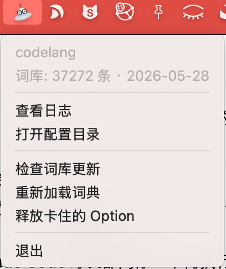
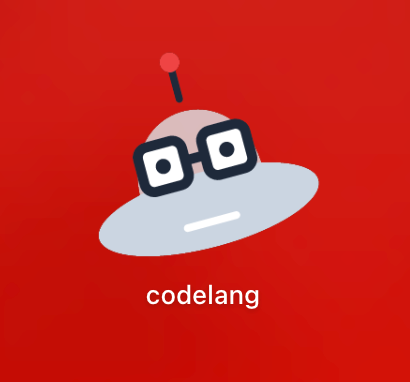

先做个小测试。下面这句话，你能听懂几个字：

> "我们先**对齐**一下这个项目的**颗粒度**，找个**抓手**给业务**赋能**，争取**拉通**各方把**链路**打通，最后形成**闭环**。"

如果你跟大多数人一样——全程认真点头，笔记记了三页，散会后发现一个字没看懂——恭喜，你不是一个人。

这些词有个共同点：**每个字你都认识，连起来就像外星语。**

## 这些社死瞬间，是不是很眼熟

**场景一：入职第一周的会议室。**
老板说"这块我们要做深做厚，先找个抓手"，你疯狂点头；他又说"颗粒度再细一点，记得对齐认知"，你点头点到脖子酸。会后同事悄悄问你"刚才那个需求你听懂了吗"，你深吸一口气："嗯……大概……方向上是懂的。"——其实方向都没找着。

**场景二：对象一开口，你只想转移话题。**
TA 两眼放光地跟你讲："我今天用 Cursor 写了个 ReAct 的 agent，把 RAG 接到向量数据库，效果直接起飞！"你盯着 TA 发亮的眼睛，深情地回了一句："……宝，你饿不饿，我给你点个奶茶？"

**场景三：HR 通知你"按 N+1 赔偿"。**
你表面镇定地说"好的我了解一下"，回到工位疯狂查 N+1：N 是几？为什么要加 1？2N 又是什么？不敢问 HR 怕显得不专业，又怕自己被算少了——一个赔偿方案，查出了高考做数学题的窒息感。

**场景四：想跟上 AI 浪潮，结果第一段就被劝退。**
你点开一篇十万加爆款《为什么 Transformer 干掉了 RNN》，立志今天一定看懂 AI。第一句："基于 attention 机制的 Transformer 架构……"你默默退出，点开了短视频，看了一只猫。

**场景五：面试官笑眯眯地问"讲讲幂等怎么保证"。**
你的大脑"嗡"地一下变成一片雪花屏。"幂……等？"你重复了一遍这两个字，仿佛多念一遍就能召唤出答案。全程社死，回家路上才想起来当时该说啥。

**场景六：工作群里飘过一句话。**
"这个需求 PRD 还没评审，先按 P0 排期，上线前记得 cc 一下相关方，TL 那边我来同步。"你盯着 P0、cc、TL 看了整整三十秒，最后默默回了个"收到👌"。

打开有道翻译想自救？查"对齐"给你 align，查"颗粒度"给你 granularity，查"Transformer"——

**给你翻译成「变压器」。**

谢谢，没事了。它翻的是字面，你缺的是**这个词在中文互联网/职场里到底想说啥**。

## codelang 登场：按住 Alt 划一下，外星语当场变人话

codelang 是个桌面小工具，干的事特别简单：

**你在任何窗口里——公众号文章、微信聊天、Word、PDF、Cursor——按住 `Alt`（Mac 是 `⌥ Option`）用鼠标划选一个看不懂的词，鼠标旁边「啪」地弹出一张卡片，用大白话告诉你它到底是个啥。**

100% 本地，不联网，按下去到卡片弹出大概 80 毫秒——比你"装懂地点头"还快。

## 它的解释，是"说人话"那一挂的

别的工具给你"高速暂存器""应用程序编程接口"这种用术语解释术语的车轱辘话。codelang 不一样，它讲的是**比喻 + 真实场景 + 例句**，不懂代码也能秒懂。

比如你划「**scope**」，它不跟你扯"作用域是标识符的可见性范围"，它跟你说——

再比如你刷 AI 文章被「**Claude**」绊住，划一下：

随便再感受几条它的画风：

> **幂等**：想象电梯按钮——你按一下电梯开始上来，你心急又连按八下，电梯还是只来一次。同一个动作做几遍，结果都一样。（面试官问的就是这个，记住电梯就行。）

> **对齐**：军训时教官喊"向左看齐"，大家原本朝八个方向，唰地调成一条线。职场里"对齐一下"就是拉几个人开个短会，把信息和理解捋成一条线。

> **N+1**：裁员标准补偿——每干满一年补一个月工资，N 就是你的工作年数，那个"+1"是额外的一个月代通知金。所以 N+1 不是数学题，是你该拿多少钱。

> **闭环**：洒出去的水又流回水库循环利用——头尾接上、自己转起来。互联网里就是一件事从头做到尾，结果还能回流到起点形成反馈，而不是做一半烂尾。

> **班味**：一个人下班回到家，衣服上还能闻到一股打工的味道——皱巴巴、僵硬、面无表情。你身上现在有没有，自己心里清楚。

每一条都是这个路子。看完你不会"哦字面意思是这样"，你会"啊——原来它在说这个！"

## 它到底能解释多少种"外星语"

**2859 条人工一条条手写的解释，7232 个查询键，外加 3.4 万常用词翻译兜底**，覆盖你日常能撞见的几乎所有黑话：

- **会议室黑话**：对齐、颗粒度、抓手、赋能、闭环、拉通、沉淀、中台、复盘——开会再也不用假装在记笔记；
- **AI / 大模型**：Transformer、RAG、agent、RLHF、MCP、vibe coding——刷 AI 资讯不再第一段就跑路；
- **面试八股**：幂等、熔断、降级、死锁、CAS、缓存击穿——面试官的连环问，一个个拆给你看；
- **缩写黑话**：OKR、KPI、GMV、PRD、P0、cc、TL、SOP——群里飘过的字母汤，秒翻；
- **HR / 钱**：N+1、2N、RSU、被优化、毕业、竞业——关乎钱包的，更得看懂；
- **网络流行语**：996、班味、牛马、上岸、老登、那咋了、哈基米——和年轻同事/小孩对话不掉线；
- 还有**网络安全、数据工程、产品运营、股市财经、游戏黑话**……一应俱全。

打错字也没关系：输入 `claud` 自动找到 Claude，`pyrhon` 自动找到 Python——手抖星人友好。

## 划到哪，都能用

任何能用鼠标选中文字的窗口都行：

浏览器、微信 / 钉钉 / 飞书、Word / Excel / PPT、PDF 阅读器、Cursor / VS Code、Claude 桌面端、Notion / Obsidian……看到不认识的词，按住 Alt 划一下就完事，不用切窗口、不用复制粘贴去搜索引擎。

## 这玩意儿到底适合谁

- ✅ **互联网新人**：上一秒"颗粒度"下一秒"赋能"，听懂同事一半，就够你忙的了；
- ✅ **正在备战面试的人**：八股文术语一个个查清楚，别再在面试官面前表演雪花屏；
- ✅ **转行做产品 / 运营 / 设计**：要听懂研发说什么，但实在不想去学编程；
- ✅ **被 AI 资讯反复劝退的人**：从今天起，技术文章能看到第二段了；
- ✅ **非程序员家属**：终于能听懂对象/孩子每天在那儿激动个啥。

## 怎么搞到手（附最懒的装法）

codelang **开源、免费、可商用（MIT）**，Windows 和 macOS 都能用。装好后，屏幕角落会多出一个戴眼镜的灰白色 UFO 小图标——它就在那儿待命，随时等你划词。

> GitHub：https://github.com/XiaoChu-1208/codelang

**最懒的装法**：如果你电脑上有 Claude Code、Cursor 这类 AI 助手，直接把上面这个仓库链接丢给它，说一句"帮我装这个并跑起来"，剩下的它全包了——你只要盯着托盘冒出那个 UFO 小图标就行。

下次再在会议室里被一串外星语砸懵，别慌，也别假装点头了——按住 Alt，划一下。

---

*关注我们，获取 codelang 的更新与新词收录。你听不懂的下一个黑话，我们正在收。*
